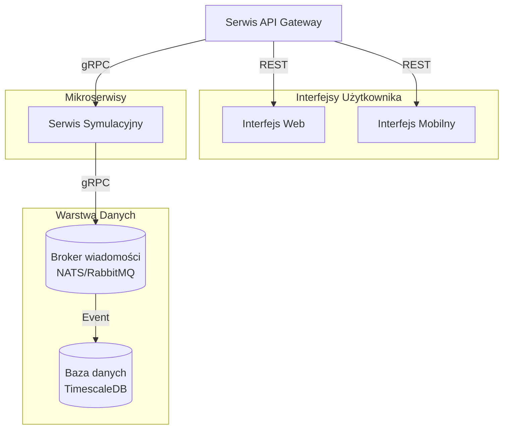

# iot-monitor-backend

```mermaid
flowchart TD
    subgraph Interfejsy Użytkownika
        WF[Interfejs Web]
        MF[Interfejs Mobilny]
    end

    GS[Serwis API Gateway]

    subgraph Warstwa Danych
        DB[(Baza danych\nTimescaleDB)]
        MQ[(Broker wiadomości\nNATS/RabbitMQ)]
    end

    subgraph Mikroserwisy
        SS[Serwis Symulacyjny]
    end

    SS -->|gRPC| MQ
    GS -->|REST| WF
    GS -->|REST| MF
    GS -->|gRPC| SS
    MQ -->|Event| DB
```
